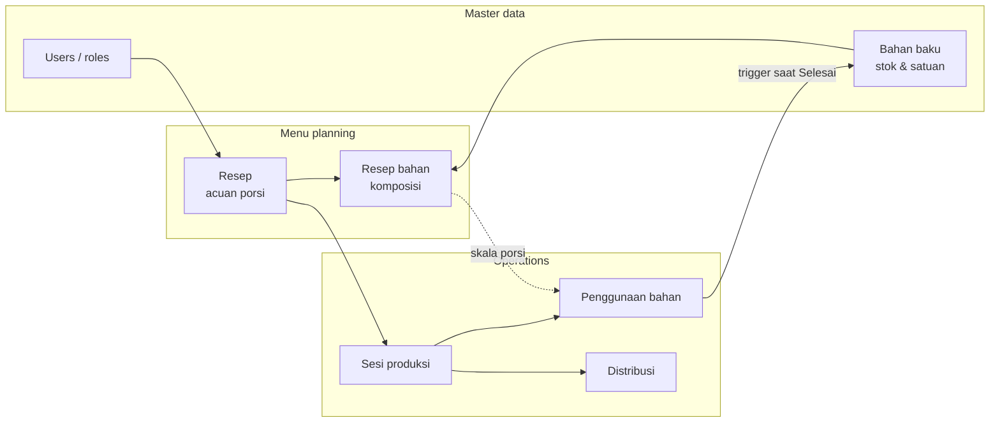

# PBT — Sistem Pencatatan Dapur MBG

Web application and API for recording kitchen operations at MBG: raw materials, recipes, production sessions, stock movements, and food distribution.

## Repository layout

| Folder | Role |
|--------|------|
| `mymbg-web` | Next.js frontend (pages, forms, CRUD UI) |
| `mymbg_backend` | ASP.NET Core minimal API (`/api/auth`, `/api/crud`, `/api/produksi`) |
| `mymbg-db` | PostgreSQL reference schema (`mymbg.sql`) and seed-style exports |

---

## Business process overview

The system follows a **master data → recipe composition → production → stock deduction → distribution** chain. Data is stored in PostgreSQL; some rules are enforced in the database (triggers, constraints).

---

## 1. Users and access

- **Users** (`users`) hold identity, email, password hash, and **role** (e.g. Admin, Staff, Kepala Dapur).
- Registration and login are handled by **`/api/auth`**. The web app stores session context and uses **`created_by`** on records where the schema requires it (e.g. resep, sesi produksi, distribusi).

---

## 2. Bahan baku (inventory)

- **Bahan baku** is the stock ledger: name, unit (**satuan**), **stok_saat_ini**, **stok_minimum**, price, category (**kategori** enum), optional notes.
- **Stok** is reduced when production is completed (see §4), not when a recipe is merely defined.
- **Stok minimum** supports operational alerts (critical stock when current stock is at or below minimum).

---

## 3. Resep (recipe / menu)

- A **resep** describes a **menu** (**nama_menu**), reference **portion count** (**jumlah_porsi**), optional description and estimated cooking time.
- **Resep bahan** (`resep_bahan`) links the recipe to **bahan baku** rows with a **quantity per reference portion** (**jumlah**). This is the template for how much of each ingredient the menu consumes **per `jumlah_porsi` portions**.

**Scaling rule (used in production):**

\[
\text{quantity needed} = \text{resep\_bahan.jumlah} \times \frac{\text{porsi yang diproduksi}}{\text{resep.jumlah\_porsi}}
\]

The UI composes recipes on a dedicated recipe form; the API persists `resep` and `resep_bahan` via generic CRUD.

---

## 4. Produksi (production session) and stock

A **sesi produksi** (`produksi` in the API) is one cooking run: which **resep**, how many **portions produced** (**jumlah_porsi_diproduksi**), **status**, **tanggal_produksi**, optional notes, and flags such as **stok_dikurangi**.

### 4.1 Penggunaan bahan (consumption lines)

- **`penggunaan_bahan`** stores, per session, each **bahan_baku_id**, **jumlah_digunakan**, **jumlah_estimasi**, and **satuan**.
- When a production session is created through **`POST /api/produksi`**, the backend:
  1. Inserts **`sesi_produksi`**.
  2. Loads **`resep_bahan`** for the chosen recipe and inserts **`penggunaan_bahan`** rows scaled by the formula in §3 (rounded to three decimals).

### 4.2 When stock actually decreases

The database trigger **`fn_kurangi_stok_produksi`** runs on **UPDATE** of **`sesi_produksi`** when:

- **Status** changes **to** **`Selesai`**, and  
- **`stok_dikurangi`** is still **false**.

Then **`bahan_baku.stok_saat_ini`** is reduced by **`penggunaan_bahan.jumlah_digunakan`** for that session. If any affected row would go negative, PostgreSQL raises an error and the transaction rolls back.

If a session is later moved from **Selesai** toward **Dibatalkan** in a way the trigger supports, stock can be rolled back (see `mymbg.sql` for the exact transition rules).

### 4.3 Web UI: “Selesai dan kurangi stok”

On **new production**, the form can enable **“Selesai dan kurangi stok bahan sekarang”**. The API then, in one transaction:

1. Inserts the session (initially as **`Direncanakan`** when finalization is required, so the **UPDATE** trigger can fire).
2. Writes **`penggunaan_bahan`**.
3. **Updates status to `Selesai`**, which triggers stock deduction.

If that option is **off**, the session keeps the chosen status (e.g. **Direncanakan** / **Berlangsung**) and stock is **not** reduced until someone sets the session to **Selesai** later **and** consumption rows already exist.

---

## 5. Distribusi (distribution)

- **Distribusi** records food sent from a **production session** to a recipient: **nama_penerima**, **lokasi**, **jumlah_porsi**, **waktu_distribusi**, optional notes, **created_by**.
- The trigger **`fn_validasi_distribusi`** ensures the **sum of distribution portions** for a session **does not exceed** **`sesi_produksi.jumlah_porsi_diproduksi`**.

---

## 6. End-to-end operational story (short)

1. Maintain **users** and **bahan baku** stock levels.  
2. Define **resep** and **resep bahan** so each menu has a clear ingredient list per reference portion.  
3. Create a **sesi produksi** for a menu and actual portion count; the system records **penggunaan bahan** from the recipe.  
4. When the kitchen **finishes** that run (**Selesai**), **stok bahan baku** drops according to those lines.  
5. Record **distribusi** so outgoing portions stay within what was produced.

---

## 7. Technical pointers (developers)

- **API base URL** (web): `NEXT_PUBLIC_API_URL` or default `http://localhost:5292/api`.
- **Generic CRUD**: `GET/POST/PUT/DELETE /api/crud/{entity}` with logical names such as `bahan-baku`, `resep`, `resep-bahan`, `produksi`, `distribusi`, `users`.
- **Dedicated production create**: `POST /api/produksi` (body: `resepId`, `jumlahPorsiDiproduksi`, optional dates/notes, `status`, `createdBy`, `kurangiStokSekarang`).
- **Schema source of truth**: `mymbg-db/mymbg.sql` (types, constraints, triggers, comments).

---

## 8. Running locally (summary)

1. **PostgreSQL**: create database, apply `mymbg-db/mymbg.sql` (or your migration equivalent). Ensure extensions such as **`uuid-ossp`** / **`pgcrypto`** exist if defaults use `uuid_generate_v4()`.
2. **Backend**: set `ConnectionStrings:DefaultConnection` (or `POSTGRES_CONNECTION_STRING`), run `mymbg_backend/MyMBG` (`dotnet run`; default port is often `5292`).
3. **Frontend**: in `mymbg-web`, set `NEXT_PUBLIC_API_URL` if needed, `npm install`, `npm run dev`.

For more detail on the Next.js app only, see `mymbg-web/README.md`.
